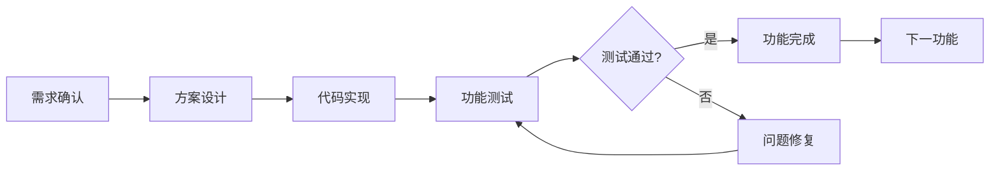
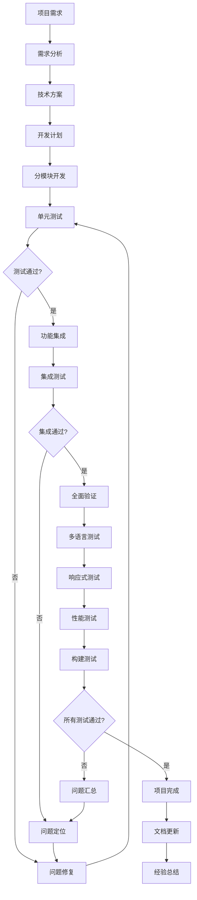
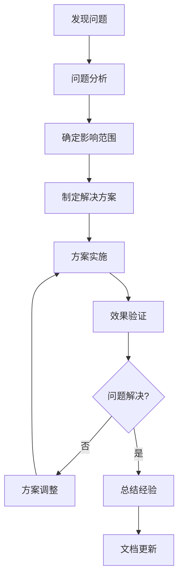

# AI协作最佳实践指南

> 基于EconWeb项目开发经验总结的高效AI协作方法论

## 📋 目录

- [项目规划阶段](#项目规划阶段)
- [高效沟通模式](#高效沟通模式)
- [开发过程最佳实践](#开发过程最佳实践)
- [代码质量保证](#代码质量保证)
- [问题反馈模板](#问题反馈模板)
- [技术架构建议](#技术架构建议)
- [协作流程图](#协作流程图)
- [常见问题预防](#常见问题预防)
- [实战案例分析](#实战案例分析)

---

## 🎯 项目规划阶段

### 核心原则
- **提前规划多语言支持**：项目初期就确定需要支持的语言版本
- **统一技术栈选择**：明确使用的框架、库和工具
- **制定代码规范**：建立统一的编码标准和最佳实践

### 多语言项目规划清单
```markdown
□ 确定支持的语言列表（如：中文、英文、韩文、日文、德文）
□ 选择国际化方案（如：next-intl、react-i18next）
□ 建立翻译key命名规范
□ 设计翻译文件结构
□ 制定UI文本处理标准（禁止硬编码）
```

### 技术选型考虑因素
- **框架兼容性**：确保所选技术栈支持国际化
- **扩展性**：考虑未来可能的功能扩展
- **维护性**：选择社区活跃、文档完善的技术

---

## 🗣️ 高效沟通模式

### 问题描述的黄金法则

#### ✅ 优秀的问题描述示例
```markdown
**问题类型**：多语言翻译问题
**具体位置**：主页搜索框下的热门标签
**当前状态**：英文界面下显示中文"热门标签："
**期望状态**：应显示"Popular Tags:"
**影响范围**：所有非中文语言版本
**优先级**：高（影响用户体验）
```

#### ❌ 需要改进的描述示例
```markdown
"翻译有问题，帮我修复一下"
```

### 沟通效率提升技巧

#### 📋 使用结构化描述
```markdown
1. **背景信息**：简述项目当前状态
2. **具体问题**：详细描述遇到的问题
3. **期望结果**：明确想要达到的效果
4. **约束条件**：提及任何限制或特殊要求
```

#### 🎯 优先级分类系统
- **🔴 高优先级**：影响核心功能、用户无法正常使用
- **🟡 中优先级**：界面优化、用户体验改善
- **🟢 低优先级**：功能增强、锦上添花

#### 📸 提供上下文信息
- 相关的代码片段
- 错误截图或日志
- 浏览器控制台信息
- 当前的项目状态

---

## 🔧 开发过程最佳实践

### 分阶段开发策略

#### 1. 需求分析阶段
```markdown
□ 明确功能需求
□ 确定技术方案
□ 评估开发难度
□ 制定开发计划
```

#### 2. 开发实施阶段
```markdown
□ 按模块逐步开发
□ 每个功能点及时测试
□ 保持代码规范一致
□ 及时提交代码变更
```

#### 3. 测试验证阶段
```markdown
□ 功能测试
□ 多语言测试
□ 响应式测试
□ 构建测试
```

### 迭代开发节奏



---

## 🧪 代码质量保证

### 质量检查清单

#### 代码层面
```bash
# 构建测试
npm run build

# 类型检查
npm run type-check

# 代码格式化
npm run format

# 代码检查
npm run lint
```

#### 功能层面
```markdown
□ 所有功能正常工作
□ 多语言切换正确
□ 响应式布局适配
□ 无控制台错误
□ 性能表现良好
```

### 持续集成思维

#### 🔄 即时验证原则
- 每次修改后立即测试
- 发现问题及时反馈
- 避免问题积累

#### 📊 质量度量指标
- 构建成功率
- 功能覆盖率
- 多语言完整性
- 用户体验评分

---

## 📝 问题反馈模板

### 通用问题反馈模板

```markdown
## 问题报告

### 基本信息
- **问题类型**：[功能/样式/翻译/性能/其他]
- **发现时间**：[YYYY-MM-DD]
- **影响范围**：[具体页面/组件/功能]
- **优先级**：[高/中/低]

### 问题描述
**当前状态**：
[详细描述当前的问题表现]

**期望状态**：
[描述期望的正确行为]

**复现步骤**：
1. [步骤1]
2. [步骤2]
3. [步骤3]

### 环境信息
- **浏览器**：[Chrome/Firefox/Safari版本]
- **设备**：[Desktop/Mobile/Tablet]
- **语言版本**：[中文/英文/韩文/日文/德文]

### 附加信息
- **错误日志**：[如有]
- **相关截图**：[如有]
- **可能的解决方案**：[如有想法]
```

### 特定场景模板

#### 🌐 多语言问题
```markdown
**翻译问题报告**
- 组件位置：[具体组件名称]
- 问题语言：[哪种语言有问题]
- 当前显示：[实际显示内容]
- 应该显示：[期望显示内容]
- 翻译key：[相关的翻译key]
```

#### 🎨 样式问题
```markdown
**样式问题报告**
- 页面位置：[具体页面/组件]
- 设备类型：[Desktop/Mobile/Tablet]
- 浏览器：[具体浏览器版本]
- 问题描述：[样式异常表现]
- 期望效果：[正确的样式表现]
```

---

## 🏗️ 技术架构建议

### 多语言架构最佳实践

#### 文件结构规范
```
lib/
├── i18n.ts              # 主翻译文件
├── resourcesI18n.ts     # 资源专用翻译
├── LanguageContext.tsx  # 语言上下文
└── utils.ts             # 工具函数
```

#### 翻译Key命名规范
```typescript
// 推荐的命名方式
const translations = {
  // 页面级别
  'page_home_title': '首页标题',
  'page_search_title': '搜索页标题',
  
  // 组件级别
  'component_header_nav': '导航菜单',
  'component_footer_copyright': '版权信息',
  
  // 功能级别
  'btn_show_more': '查看更多',
  'btn_collapse': '收起',
  
  // 状态级别
  'status_loading': '加载中',
  'status_error': '错误',
}
```

#### 代码一致性原则
```typescript
// ✅ 正确的做法
const title = t('page_home_title');

// ❌ 避免的做法
const title = '首页标题';
```

### 组件设计原则

#### 单一职责原则
```typescript
// ✅ 职责明确的组件
const SearchBox = () => { /* 只负责搜索功能 */ };
const LanguageSwitcher = () => { /* 只负责语言切换 */ };

// ❌ 职责混乱的组件
const HeaderWithEverything = () => { /* 包含导航、搜索、语言切换等 */ };
```

#### 可复用性设计
```typescript
// ✅ 可复用的按钮组件
interface ButtonProps {
  variant: 'primary' | 'secondary';
  size: 'sm' | 'md' | 'lg';
  children: React.ReactNode;
  onClick?: () => void;
}

const Button: React.FC<ButtonProps> = ({ variant, size, children, onClick }) => {
  return (
    <button 
      className={`btn btn-${variant} btn-${size}`}
      onClick={onClick}
    >
      {children}
    </button>
  );
};
```

---

## 🔄 协作流程图

### 完整的协作流程



### 问题解决流程



---

## ⚠️ 常见问题预防

### 开发阶段常见陷阱

#### 🚫 需要避免的做法
```markdown
1. **硬编码文本**
   - ❌ `<button>查看更多</button>`
   - ✅ `<button>{t('btn_show_more')}</button>`

2. **混合使用翻译方式**
   - ❌ 有些用翻译函数，有些硬编码
   - ✅ 统一使用翻译函数

3. **忽略边界情况**
   - ❌ 只测试主要功能
   - ✅ 测试各种边界情况

4. **缺少错误处理**
   - ❌ 假设所有操作都成功
   - ✅ 添加适当的错误处理

5. **不及时测试**
   - ❌ 开发完成后一次性测试
   - ✅ 每个功能完成后立即测试
```

#### ✅ 推荐的最佳实践
```markdown
1. **渐进式开发**
   - 按功能模块逐步完成
   - 每个模块完成后立即验证

2. **统一的代码风格**
   - 使用统一的组件设计模式
   - 保持命名规范一致

3. **完善的测试覆盖**
   - 功能测试
   - 多语言测试
   - 响应式测试
   - 构建测试

4. **及时的反馈沟通**
   - 遇到问题立即反馈
   - 提供详细的问题描述
   - 确认修复效果
```

### 沟通过程常见问题

#### 🚫 低效的沟通方式
```markdown
- "这个功能有问题"（太模糊）
- "帮我修复一下"（缺少具体信息）
- "翻译不对"（没有指明具体位置）
- 一次性提出很多不同类型的问题
```

#### ✅ 高效的沟通方式
```markdown
- 提供具体的问题位置和描述
- 明确期望的结果
- 按优先级分类问题
- 一次专注解决一类问题
```

---

## 📚 实战案例分析

### 案例1：多语言翻译问题解决

#### 问题描述
EconWeb项目中发现英文界面下专题标题显示翻译key而非实际英文文本。

#### 解决过程
1. **问题定位**：检查i18n.ts文件，发现缺少对应的英文翻译
2. **影响范围评估**：影响所有非中文语言版本
3. **解决方案**：添加缺失的翻译key和对应的翻译文本
4. **验证测试**：构建项目确保无错误

#### 经验总结
- 建立完整的翻译映射很重要
- 需要为所有支持的语言提供翻译
- 构建测试能及时发现问题

### 案例2：按钮文本多语言化

#### 问题描述
"查看更多"和"收起"按钮在非中文界面下仍显示中文。

#### 解决过程
1. **代码审查**：发现按钮文本硬编码
2. **统一修改**：将所有硬编码文本改为翻译函数
3. **翻译补全**：为所有语言版本添加对应翻译
4. **全面测试**：验证所有语言版本的显示效果

#### 经验总结
- 避免硬编码文本是多语言项目的基本原则
- 需要系统性地检查和修复
- 统一的修改策略能提高效率

### 案例3：热门标签翻译优化

#### 问题描述
搜索框下的热门标签在不同语言版本下显示不一致。

#### 解决过程
1. **功能分析**：理解热门标签的动态生成逻辑
2. **翻译机制**：实现标签内容的动态翻译
3. **UI文本统一**：确保"热门标签"标题也正确翻译
4. **交互优化**：保证标签点击功能正常

#### 经验总结
- 动态内容的翻译需要特别注意
- UI文本和数据内容都需要考虑多语言
- 功能性和显示效果要兼顾

---

## 🎯 成功协作的关键要素

### 沟通层面
- **明确性**：问题描述要具体明确
- **完整性**：提供足够的上下文信息
- **及时性**：问题发现后及时反馈
- **结构性**：使用模板化的描述方式

### 技术层面
- **一致性**：保持代码风格和架构一致
- **可维护性**：编写易于理解和修改的代码
- **可扩展性**：考虑未来的功能扩展需求
- **健壮性**：添加必要的错误处理和边界检查

### 流程层面
- **渐进式**：按模块逐步完成开发
- **验证性**：每个阶段都进行充分测试
- **文档化**：及时更新相关文档
- **总结性**：项目完成后总结经验教训

---

## 📖 学习资源推荐

### 技术文档
- [Next.js国际化文档](https://nextjs.org/docs/advanced-features/i18n)
- [React国际化最佳实践](https://react.i18next.com/)
- [TypeScript官方文档](https://www.typescriptlang.org/docs/)

### 设计规范
- [Material Design国际化指南](https://material.io/design/usability/bidirectionality.html)
- [Apple人机界面指南](https://developer.apple.com/design/human-interface-guidelines/)

### 工具推荐
- **代码质量**：ESLint, Prettier, TypeScript
- **测试工具**：Jest, React Testing Library
- **构建工具**：Next.js, Webpack
- **版本控制**：Git, GitHub

---

## 🔚 总结

通过遵循这份指南，我们可以实现：

- **🚀 更高的开发效率**：清晰的沟通减少误解
- **🎯 更好的代码质量**：统一的标准确保一致性
- **⚡ 更快的问题解决**：结构化的方法提高效率
- **📈 更强的可维护性**：良好的架构便于后续扩展

记住，优秀的协作不仅仅是技术层面的配合，更是沟通方式和工作流程的优化。希望这份指南能帮助你在未来的AI协作中取得更好的成果！

---

*最后更新：2025年6月25日*
*基于EconWeb项目实战经验总结* 